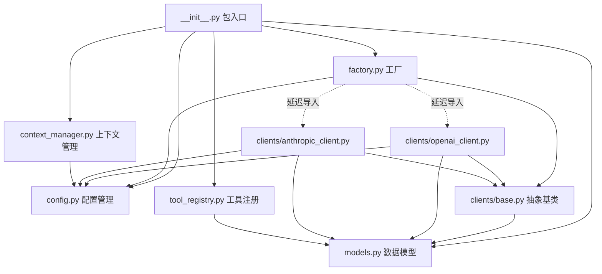
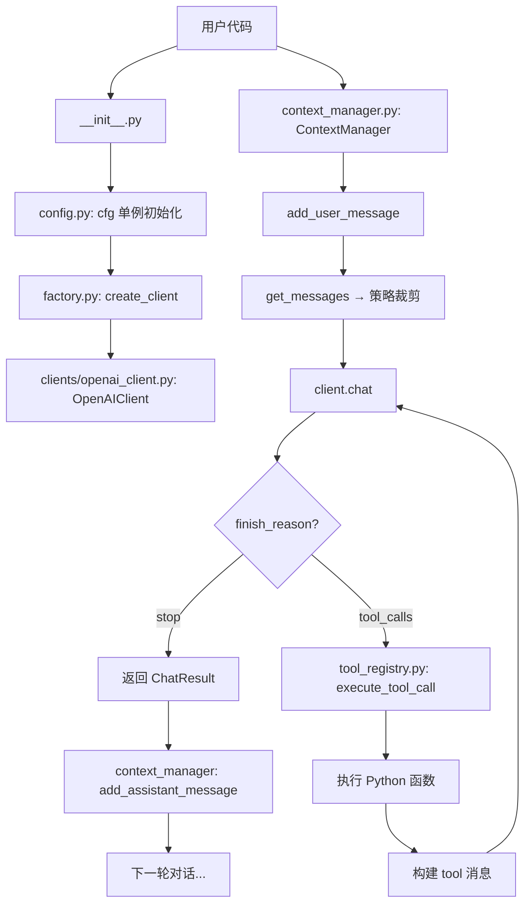

# advanced_llm 模块调用顺序与架构深度解析

## 一、模块总览

```
advanced_llm/
├── __init__.py           # 包入口：统一导出公共 API
├── config.py             # 第①层：配置管理（全局单例）
├── models.py             # 第②层：数据模型（纯数据结构）
├── factory.py            # 第③层：客户端工厂（创建客户端）
├── context_manager.py    # 第④层：上下文管理（多轮对话）
├── tool_registry.py      # 第⑤层：工具注册中心（Function Calling）
└── clients/
    ├── __init__.py       # 子包入口
    ├── base.py           # 第③层：抽象基类（接口契约）
    ├── openai_client.py  # 第③层：OpenAI 格式实现
    └── anthropic_client.py # 第③层：Anthropic 格式实现
```

---

## 二、模块依赖关系图



**关键观察：**
- `models.py` 是最底层的"叶子节点"，不依赖包内任何其他模块
- `config.py` 是基础设施层，被几乎所有模块依赖
- `factory.py` 通过**延迟导入**（虚线）连接具体客户端，避免启动时加载不需要的 SDK

---

## 三、正常调用顺序（从启动到完成一次对话）

### 阶段 1：包导入与初始化

```python
from advanced_llm import create_client, cfg
```

**内部执行顺序：**

```
① config.py 被加载
   └── cfg = Config() 执行
       ├── _load_env_files()  → 按优先级加载 .env / .env.models / .env.{APP_ENV}
       ├── 解析通用配置（MAX_TOKENS, TEMPERATURE, TIMEOUT 等）
       ├── _load_models()     → 从环境变量注册所有模型（ModelConfig 对象）
       └── 确定 ACTIVE_MODEL  → 设置默认激活模型

② models.py 被加载
   └── 定义 ChatResult / StreamChunk / ToolCallRequest 等数据类（无副作用）

③ factory.py 被加载
   └── 定义 create_client() 函数和 _PROVIDER_IMPORTS 映射表（此时不导入任何客户端）

④ context_manager.py 被加载
   └── 定义 ContextManager 和 4 种策略类（无副作用）

⑤ tool_registry.py 被加载
   └── 定义 ToolRegistry 类（无副作用）
```

> **核心知识点：** Python 的 `import` 机制保证每个模块只执行一次。无论多少处 `from advanced_llm.config import cfg`，`Config()` 只会被调用一次。

---

### 阶段 2：创建客户端

```python
client = create_client("deepseek")
```

**内部执行顺序：**

```
① factory.py → create_client("deepseek")
   ├── cfg.get_model("deepseek")       → 从配置中获取 ModelConfig
   │   └── 返回 ModelConfig(name="deepseek", provider="openai", ...)
   ├── _get_client_class("openai")     → 查注册表，动态导入
   │   ├── 检查 _CLIENT_CACHE（首次未命中）
   │   ├── importlib.import_module("advanced_llm.clients.openai_client")
   │   ├── getattr(module, "OpenAIClient")  → 获取类对象
   │   └── 存入 _CLIENT_CACHE（下次直接取）
   └── OpenAIClient("deepseek")        → 实例化
       ├── super().__init__("deepseek")  → BaseLLMClient.__init__
       │   ├── from advanced_llm.config import cfg  （延迟导入避免循环依赖）
       │   ├── cfg.get_model("deepseek") → 读取模型配置
       │   └── 设置 self.model / self.provider / self.enable_thinking 等
       └── OpenAI(api_key=..., base_url=..., timeout=...)  → 创建 SDK 客户端
```

> **核心知识点：** 工厂模式 + 延迟导入 = 用 DeepSeek 时不会加载 anthropic SDK，减少启动时间和依赖。

---

### 阶段 3：非流式对话调用

```python
result = client.chat([{"role": "user", "content": "你好"}])
print(result.content)
```

**内部执行顺序（以 OpenAIClient 为例）：**

```
① OpenAIClient.chat(messages)
   ├── _build_kwargs(stream=False)     → 构建请求参数
   │   ├── 设置 model / max_tokens / stream
   │   ├── 判断是否开启 thinking → 构建 extra_body
   │   ├── 思考模式下跳过 temperature（DeepSeek 限制）
   │   └── 合并 tools / tool_choice（如果有）
   ├── self.client.chat.completions.create(**kwargs)  → 发送 HTTP 请求
   │   └── POST https://api.deepseek.com/chat/completions
   └── 解析响应 → 构建 ChatResult
       ├── message.content          → result.content
       ├── getattr(message, "reasoning_content", None) → result.reasoning
       ├── response.usage           → result.usage
       ├── choice.finish_reason     → result.finish_reason
       └── message.tool_calls       → result.tool_calls（如果有）
```

---

### 阶段 4：流式对话调用

```python
for chunk in client.chat_stream([{"role": "user", "content": "你好"}]):
    if chunk.type == "content":
        print(chunk.data, end="")
```

**内部执行顺序：**

```
① OpenAIClient.chat_stream(messages)
   ├── _build_kwargs(stream=True)      → 构建流式请求参数
   │   └── 额外设置 stream_options={"include_usage": True}
   ├── self.client.chat.completions.create(**kwargs)  → 建立 SSE 连接
   └── for chunk in stream:            → 逐块迭代
       ├── chunk.choices 为空 → yield StreamChunk(type="done", usage=...)
       ├── delta.reasoning_content 有值 → yield StreamChunk(type="reasoning", data=...)
       └── delta.content 有值 → yield StreamChunk(type="content", data=...)
```

**StreamChunk 的生命周期：**
```
[reasoning] → [reasoning] → ... → [content] → [content] → ... → [done]
   思考阶段（可选）                    回答阶段                    结束
```

---

### 阶段 5：多轮对话（上下文管理）

```python
from advanced_llm import ContextManager, HybridStrategy

cm = ContextManager(
    system_prompt="你是一个有帮助的AI助手。",
    strategy=HybridStrategy(max_rounds=10, max_tokens=8000)
)

# 第 1 轮
cm.add_user_message("我叫小明")
result = client.chat(cm.get_messages())
cm.add_assistant_message(result.content, reasoning=result.reasoning)

# 第 2 轮
cm.add_user_message("我叫什么名字？")
messages = cm.get_messages()  # ← 此处自动应用策略裁剪历史
result = client.chat(messages)
```

**内部执行顺序：**

```
① ContextManager.__init__()
   ├── 读取 cfg.MAX_HISTORY_ROUNDS / cfg.MAX_CONTEXT_TOKENS（默认参数）
   ├── 创建 HybridStrategy（组合 SlidingWindow + TokenBudget）
   └── 初始化 _messages = [{"role": "system", "content": ...}]

② cm.add_user_message("我叫小明")
   └── _messages.append({"role": "user", "content": "我叫小明"})

③ cm.get_messages()
   └── strategy.manage(self._messages)
       ├── SlidingWindowStrategy.manage()  → 按轮数粗截断
       └── TokenBudgetStrategy.manage()    → 按 token 预算精确截断
           ├── estimate_messages_tokens()  → 估算每条消息的 token 数
           └── 从后往前累加，超出预算则截断

④ cm.add_assistant_message(content, reasoning)
   ├── 判断是否有 tool_calls → 决定是否保留 reasoning
   │   ├── 无工具调用 → 丢弃 reasoning（节省 token）
   │   └── 有工具调用 → 必须保留 reasoning（API 要求）
   └── _messages.append({"role": "assistant", "content": ...})
```

---

### 阶段 6：工具调用（Function Calling）

```python
from advanced_llm import create_default_registry

registry = create_default_registry()
tools = registry.get_openai_schemas()

# 第一次调用：模型决定调用工具
result = client.chat(messages, tools=tools)

if result.has_tool_calls:
    for tc in result.tool_calls:
        tool_result = registry.execute_tool_call(tc)
        # 将结果喂回模型...
```

**完整工具调用流程：**

```
① 准备阶段
   ├── create_default_registry()  → 注册 get_weather / calculate / search_docs / get_current_time
   └── registry.get_openai_schemas()  → 生成 JSON Schema 列表

② 第一次 API 调用（告诉模型有哪些工具）
   client.chat(messages, tools=schemas)
   └── 模型返回: finish_reason="tool_calls"
       └── tool_calls = [ToolCallRequest(id="call_xxx", name="get_weather", arguments='{"city":"北京"}')]

③ 执行工具
   registry.execute_tool_call(tool_call)
   ├── json.loads(tool_call.arguments)  → 解析 JSON 字符串为字典
   ├── self.execute("get_weather", {"city": "北京"})
   │   ├── 从 _tools 字典中查找 ToolDefinition
   │   ├── tool.func(**arguments)  → 调用实际 Python 函数
   │   └── 包装为 ToolCallResult(success=True, result="晴，28~35°C")
   └── 设置 result.tool_call_id = tool_call.id（对应关系）

④ 第二次 API 调用（将工具结果喂回模型）
   messages.append({"role": "assistant", "content": None, "tool_calls": [...]})
   messages.append({"role": "tool", "tool_call_id": "call_xxx", "content": "晴，28~35°C"})
   result = client.chat(messages)
   └── 模型基于工具结果生成最终回答: "北京今天晴天，28~35°C，适合出行。"
```

---

## 四、完整调用链路图（一次带工具的多轮对话）



---

## 五、各模块核心设计模式总结

| 模块 | 设计模式 | 体现 |
|------|---------|------|
| `config.py` | **单例模式** | `cfg = Config()` 模块级变量，全局唯一 |
| `config.py` | **分层配置** | `.env` → `.env.models` → `.env.{APP_ENV}` 层叠覆盖 |
| `models.py` | **值对象模式** | `@dataclass` 不可变数据容器，关注"值是什么" |
| `clients/base.py` | **模板方法模式** | 父类定义骨架 `chat_stream_print()`，子类实现 `chat_stream()` |
| `clients/base.py` | **依赖倒置原则** | 上层只依赖 `BaseLLMClient` 抽象，不依赖具体实现 |
| `openai_client.py` | **适配器模式** | 将厂商响应统一转换为 `ChatResult` |
| `anthropic_client.py` | **适配器模式** | OpenAI 格式 ↔ Anthropic 格式双向转换 |
| `factory.py` | **简单工厂模式** | `create_client()` 根据 provider 自动选择客户端 |
| `factory.py` | **注册表模式** | `_PROVIDER_IMPORTS` 映射表，新增 provider 只加一行 |
| `factory.py` | **延迟导入** | `importlib.import_module()` 按需加载，减少依赖 |
| `context_manager.py` | **策略模式** | 4 种可替换的上下文裁剪策略 |
| `tool_registry.py` | **注册表模式** | 工具集中注册、查询、执行 |
| `tool_registry.py` | **装饰器模式** | `@registry.tool()` 定义即注册 |

---

## 六、模块加载的"时间线"视角

理解模块加载顺序的关键：**Python import 是递归的、有缓存的**。

```
时间轴 ─────────────────────────────────────────────────────────────────►

t0: from advanced_llm import create_client
    │
    ├── t1: 加载 advanced_llm/__init__.py
    │       │
    │       ├── t2: 加载 config.py
    │       │       └── 执行 cfg = Config()
    │       │           ├── 加载 .env 文件
    │       │           ├── 注册模型
    │       │           └── ✅ cfg 单例就绪
    │       │
    │       ├── t3: 加载 models.py
    │       │       └── 定义数据类（无 I/O，极快）
    │       │
    │       ├── t4: 加载 factory.py
    │       │       ├── import config（已在 sys.modules，直接取）
    │       │       ├── import clients/base.py
    │       │       │   └── import models（已在 sys.modules，直接取）
    │       │       └── 定义函数（不执行客户端导入）
    │       │
    │       ├── t5: 加载 context_manager.py
    │       │       └── 定义策略类
    │       │
    │       └── t6: 加载 tool_registry.py
    │               └── import models（已在 sys.modules，直接取）
    │
    └── ✅ 包导入完成

t7: client = create_client("deepseek")
    │
    ├── t8: importlib.import_module("advanced_llm.clients.openai_client")
    │       └── import openai SDK（首次加载，耗时较长）
    │
    └── t9: OpenAIClient("deepseek") 实例化
            └── OpenAI(api_key=..., base_url=...) 创建 HTTP 客户端

t10: result = client.chat(messages)
     └── 发送 HTTP 请求 → 等待响应 → 解析为 ChatResult
```

---

## 七、关键设计决策解析

### 1. 为什么 models.py 要独立存在？

```
❌ 如果 ChatResult 定义在 openai_client.py 中：
   openai_client.py ← anthropic_client.py（需要 ChatResult）
   factory.py ← openai_client.py
   factory.py ← anthropic_client.py
   → 耦合严重，改一个文件影响一片

✅ 独立为 models.py：
   models.py ← openai_client.py
   models.py ← anthropic_client.py
   models.py ← tool_registry.py
   models.py ← context_manager.py
   → 所有模块单向依赖 models.py，models.py 不依赖任何人
```

**原则：被多人依赖的东西，要放在最稳定的位置。**

### 2. 为什么 factory.py 用延迟导入？

```python
# ❌ 顶部直接导入
from advanced_llm.clients.openai_client import OpenAIClient
from advanced_llm.clients.anthropic_client import AnthropicClient
# 问题：用户只用 DeepSeek，但 anthropic SDK 没装 → ImportError 全局崩溃

# ✅ 延迟导入
module = importlib.import_module("advanced_llm.clients.openai_client")
# 好处：只在需要时才导入，未安装的 SDK 不影响其他功能
```

### 3. 为什么 config.py 用模块级单例？

```python
# Python 的 import 机制天然保证单例：
# 无论多少处 import，模块代码只执行一次
cfg = Config()  # 只执行一次！

# 验证：
from advanced_llm.config import cfg as a
from advanced_llm.config import cfg as b
print(a is b)  # True
```

### 4. reasoning_content 的回传规则

```
┌──────────────────────────────────────────────────────────────────┐
│  无工具调用 → reasoning 可丢弃（节省 token，降低成本）           │
│  有工具调用 → reasoning 必须保留（API 强制要求，否则报错）       │
└──────────────────────────────────────────────────────────────────┘

原因：思考过程包含"为什么调这个工具"的推理链，
     丢弃后模型在后续轮次中会"忘记"调用原因，导致逻辑断裂。
```

---

## 八、扩展指南：如何新增一个模型 Provider

假设要新增 Ollama（本地模型）支持：

**Step 1：** 创建 `clients/ollama_client.py`
```python
from advanced_llm.clients.base import BaseLLMClient
from advanced_llm.models import ChatResult, StreamChunk

class OllamaClient(BaseLLMClient):
    def chat(self, messages, **kwargs) -> ChatResult: ...
    def chat_stream(self, messages, **kwargs): ...
```

**Step 2：** 在 `factory.py` 注册
```python
_PROVIDER_IMPORTS = {
    "openai": ("advanced_llm.clients.openai_client", "OpenAIClient"),
    "anthropic": ("advanced_llm.clients.anthropic_client", "AnthropicClient"),
    "ollama": ("advanced_llm.clients.ollama_client", "OllamaClient"),  # 新增一行
}
```

**Step 3：** 在 `config.py` 注册模型
```python
KNOWN_MODELS = ["deepseek", "qwen", "kimi", "claude", "ollama"]
DEFAULT_PROVIDERS["ollama"] = "ollama"
```

**Step 4：** 在 `.env.models` 添加配置
```env
OLLAMA_API_KEY=not-needed
OLLAMA_BASE_URL=http://localhost:11434/v1
OLLAMA_MODEL=llama3
OLLAMA_PROVIDER=ollama
```

**完成！** 上层代码零修改：`client = create_client("ollama")` 即可使用。

---

## 九、核心调用顺序一句话总结

> **config（配置就绪）→ models（数据结构就绪）→ factory（按配置创建客户端）→ client.chat/stream（发起调用）→ context_manager（管理多轮历史）→ tool_registry（执行工具调用）**

这是一个**自底向上初始化、自顶向下调用**的经典分层架构。
