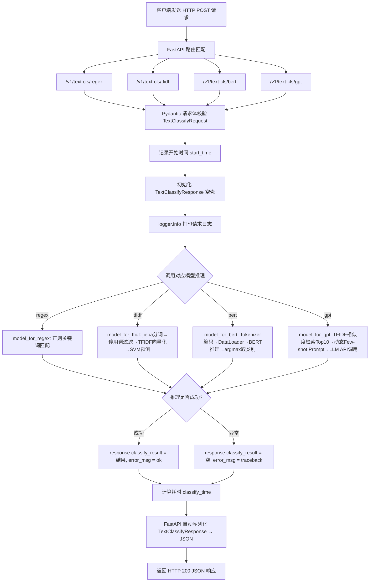

# 01-intent-classify 意图识别文本分类服务

## 一、项目概述

本项目是一个**中文意图识别（文本分类）服务**，将用户输入的自然语言文本分类到 12 个预定义意图类别中（如音乐播放、天气查询、家电控制等），并以 HTTP API 形式对外提供服务。

项目亮点：同一服务中集成了 **4 种不同技术方案**，从简单到复杂，方便对比学习。

### 12 个意图类别

| 类别 | 含义 |
|------|------|
| Travel-Query | 出行查询 |
| Music-Play | 音乐播放 |
| FilmTele-Play | 影视播放 |
| Video-Play | 视频播放 |
| Radio-Listen | 广播收听 |
| HomeAppliance-Control | 家电控制 |
| Weather-Query | 天气查询 |
| Alarm-Update | 闹钟设置 |
| Calendar-Query | 日历查询 |
| TVProgram-Play | 电视节目播放 |
| Audio-Play | 音频播放 |
| Other | 其他 |

---

## 二、请求处理流程图



---

## 三、项目目录结构

```
01-intent-classify/
├── main.py                  # ★ FastAPI 服务入口，定义 4 个 POST 接口
├── fastapi_demp.py          # FastAPI 最简示例（学习用）
├── config.py                # 全局配置（正则规则、模型路径、LLM密钥）
├── data_schema.py           # Pydantic 请求/响应数据模型
├── logger.py                # 日志配置（文件+控制台双输出）
├── model/                   # ★ 4 种分类模型实现
│   ├── regex_rule.py        #   方案1：正则规则匹配
│   ├── tfidf_ml.py          #   方案2：TF-IDF + SVM
│   ├── bert.py              #   方案3：BERT 深度学习
│   └── prompt.py            #   方案4：LLM + Few-shot Prompt
├── training_code/           # 模型训练脚本
│   ├── train_tfidf.py       #   TF-IDF + SVM 训练
│   └── train_bert.py        #   BERT 微调训练
├── assets/
│   ├── dataset/dataset.csv  # 训练数据集（文本\t标签）
│   └── weights/             # 模型权重文件（需训练生成）
├── test/data.json           # 压测请求数据
├── doc/                     # 项目文档
└── README.md
```

---

## 四、核心技术栈

| 层次 | 技术 | 用途 |
|------|------|------|
| Web 框架 | FastAPI + Uvicorn | HTTP 服务、自动文档、类型校验 |
| 数据校验 | Pydantic | 请求/响应结构定义与自动验证 |
| 传统 ML | scikit-learn (TF-IDF + LinearSVC) | 轻量级文本分类 |
| 中文分词 | jieba | 中文文本预处理 |
| 深度学习 | PyTorch + Transformers (BERT) | 高精度文本分类 |
| 大模型 | OpenAI SDK（兼容接口）→ 通义千问 | LLM Few-shot 分类 |
| 日志 | Python logging | 请求追踪与异常记录 |

---

## 五、四种分类方案对比

| 维度 | 正则规则 | TF-IDF + SVM | BERT | LLM Prompt |
|------|----------|--------------|------|------------|
| 原理 | 关键词包含匹配 | 词频统计 + 线性分类器 | 预训练语言模型微调 | 大模型 + 动态 Few-shot |
| 精度 | 低 | 中 | 高 | 高 |
| 速度 | 极快（μs级） | 快（ms级） | 中（数十ms） | 慢（数百ms~秒级） |
| 是否需要训练 | 否 | 是 | 是 | 否（但需检索） |
| 是否需要GPU | 否 | 否 | 推荐 | 否（云端推理） |
| 可扩展性 | 差（需手写规则） | 中 | 好 | 好 |
| 适用场景 | 兜底/快速过滤 | 资源受限场景 | 生产主力 | 冷启动/标注辅助 |

---

## 六、请求处理流程详解

### 6.1 统一流程

所有 4 个接口遵循相同模式：

1. **接收请求**：FastAPI 路由匹配 → Pydantic 自动校验 `TextClassifyRequest`
2. **初始化响应**：创建空的 `TextClassifyResponse` 对象
3. **记录日志**：logger 打印请求信息
4. **模型推理**：调用对应的 `model_for_xxx()` 函数
5. **异常捕获**：try/except 包裹，失败时记录完整 traceback
6. **计算耗时**：记录推理时间
7. **返回 JSON**：Pydantic 自动序列化为 JSON 响应

### 6.2 各模型推理细节

**正则规则 (model/regex_rule.py)**
- 启动时预编译正则表达式（`re.compile`）
- 对输入文本执行 `findall` 匹配
- 支持单条 str 和批量 list[str]

**TF-IDF + SVM (model/tfidf_ml.py)**
- 启动时加载序列化的 `(tfidf, model)` 对象
- 推理时：jieba 分词 → 去停用词 → TF-IDF 向量化 → SVM 预测

**BERT (model/bert.py)**
- 启动时加载预训练模型 + 微调权重到 GPU/CPU
- 推理时：Tokenizer 编码 → 构建 DataLoader → 模型前向推理 → argmax 取类别索引 → 映射为类别名

**LLM Prompt (model/prompt.py)**
- 启动时加载训练数据并计算全量 TF-IDF 特征
- 推理时：计算输入与训练集的余弦相似度 → 取 Top10 作为 Few-shot 示例 → 拼装动态 Prompt → 调用 LLM API

---

## 七、快速上手

### 7.1 环境安装

```bash
pip install fastapi uvicorn scikit-learn jieba joblib pandas
pip install torch transformers datasets
pip install openai
```

### 7.2 训练模型

```bash
cd 01-intent-classify
python training_code/train_tfidf.py
python training_code/train_bert.py
```

### 7.3 启动服务

```bash
fastapi run main.py
# 或
uvicorn main:app --host 0.0.0.0 --port 8000
```

### 7.4 测试接口

```bash
curl -X POST http://0.0.0.0:8000/v1/text-cls/tfidf \
  -H "Content-Type: application/json" \
  -d '{"request_id": "test-001", "request_text": "帮我播放周杰伦的歌曲"}'
```

### 7.5 访问自动文档

浏览器打开 `http://0.0.0.0:8000/docs` 即可查看 Swagger UI 交互式 API 文档。

---

## 八、压测服务

```bash
cd test/

ab -n 100 -c 100 -p data.json -T 'application/json' -H 'accept: application/json' 'http://0.0.0.0:8000/v1/text-cls/regex'
ab -n 100 -c 100 -p data.json -T 'application/json' -H 'accept: application/json' 'http://0.0.0.0:8000/v1/text-cls/tfidf'
ab -n 100 -c 100 -p data.json -T 'application/json' -H 'accept: application/json' 'http://0.0.0.0:8000/v1/text-cls/bert'
```

---

## 九、学习路线建议

| 阶段 | 内容 | 对应文件 |
|------|------|----------|
| 第1步 | 理解 FastAPI 基本用法 | `fastapi_demp.py` |
| 第2步 | 理解数据校验与接口规范 | `data_schema.py` |
| 第3步 | 学习最简单的正则分类 | `model/regex_rule.py` + `config.py` |
| 第4步 | 学习传统 ML 分类流程 | `training_code/train_tfidf.py` → `model/tfidf_ml.py` |
| 第5步 | 学习深度学习分类 | `training_code/train_bert.py` → `model/bert.py` |
| 第6步 | 学习 LLM 应用（RAG+Prompt） | `model/prompt.py` |
| 第7步 | 学习服务化与工程化 | `main.py` + `logger.py` + 压测 |

---

## 十、关键设计思想

1. **统一接口，多模型并存**：通过 URL 路径区分模型，方便 A/B 对比
2. **Pydantic 数据契约**：请求/响应结构强类型，自动生成文档和校验
3. **模型预加载**：所有模型在服务启动时一次性加载到内存，避免请求时重复 IO
4. **全局异常兜底**：每个接口 try/except 包裹，保证服务不因单次推理失败而崩溃
5. **动态 Few-shot**：LLM 方案不是固定 Prompt，而是根据输入动态检索最相似样本，提升分类准确率
6. **耗时埋点**：每次请求记录推理耗时，便于性能监控和优化

---

## 十一、部署

```bash
fastapi run main.py
```
