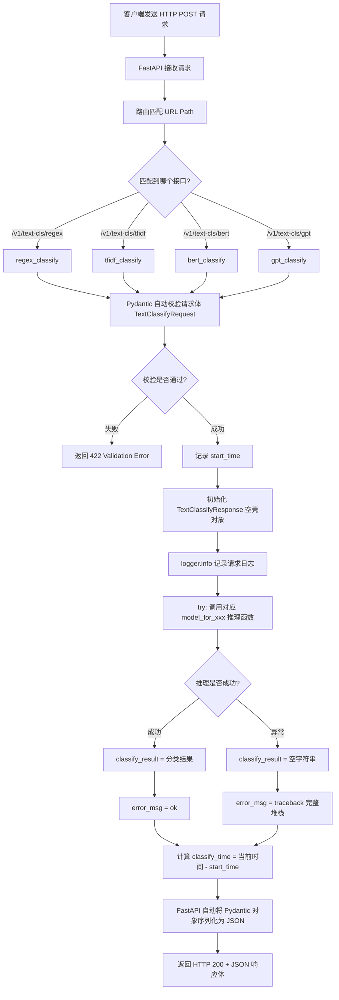
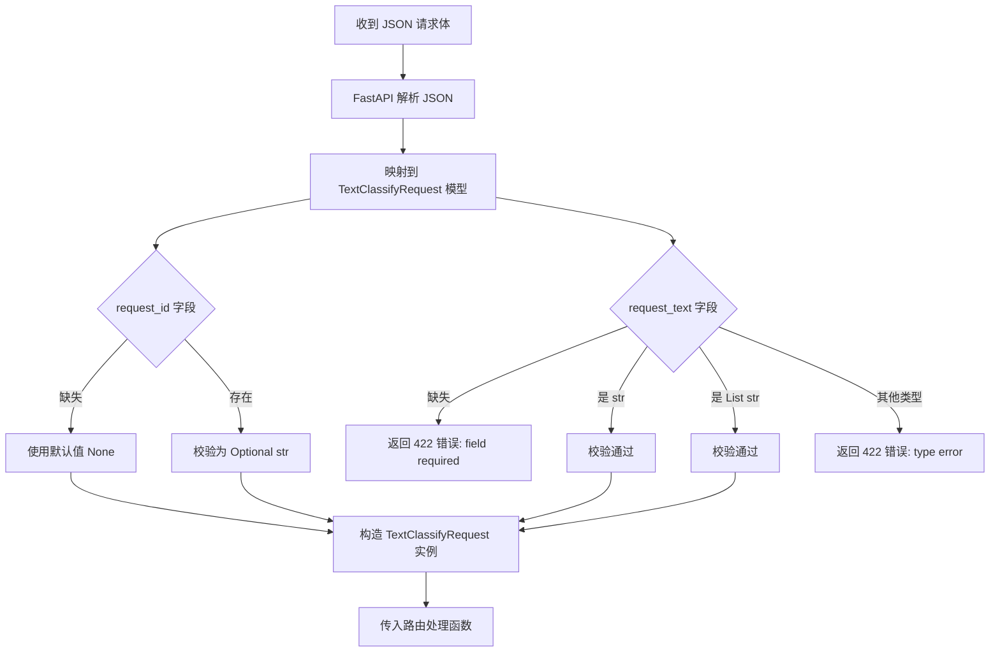
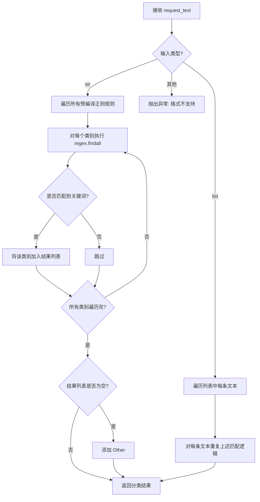
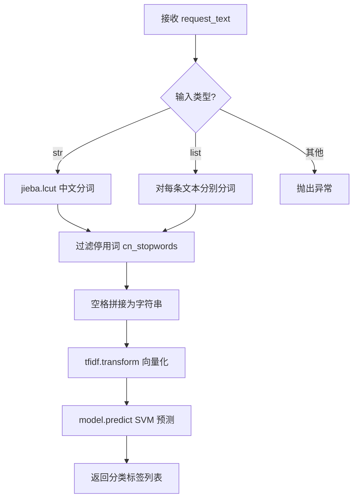
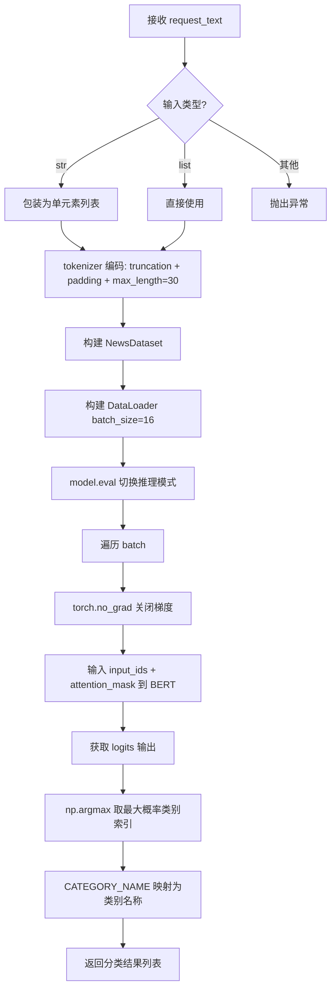
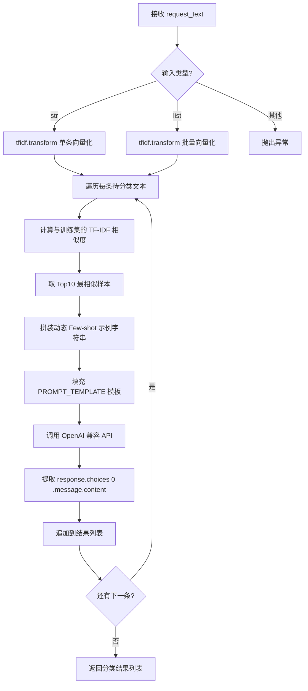
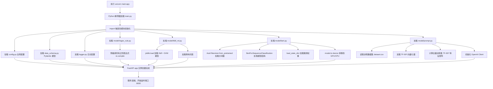
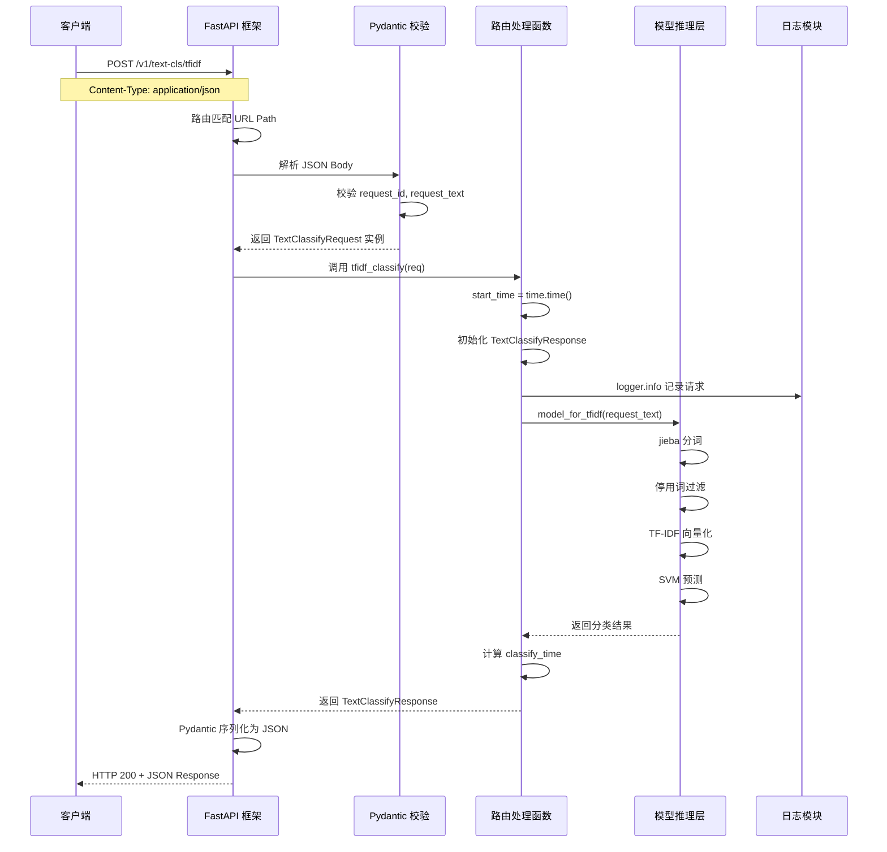

# FastAPI 请求处理流程图

## 一、总体请求处理流程

---

## 二、Pydantic 数据校验细节

---

## 三、四种模型推理内部流程

### 3.1 正则规则匹配 (model_for_regex)

### 3.2 TF-IDF + SVM (model_for_tfidf)

### 3.3 BERT 深度学习 (model_for_bert)

### 3.4 LLM + Few-shot Prompt (model_for_gpt)

---

## 四、服务启动与模型预加载流程

---

## 五、完整请求生命周期（端到端）

